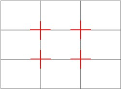
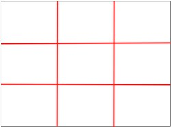
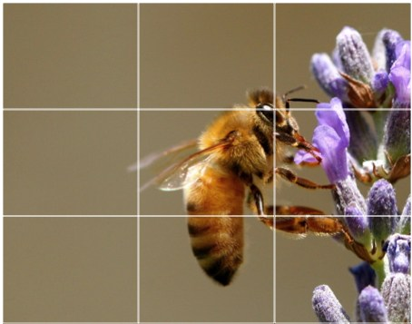

# Use Classic Composition

<a href="https://umontana.zoom.us/rec/play/6JB4cLqp_D43TIWTuASDA_d_W429KqqshicbqfoKyE-3WyQFNlKnZLAQZeVxEh3n1Xq1cFIZ16foDU0R?autoplay=true&startTime=1585680802000">Video</a>

You want to think about the rule of thirds.  [Digital Photography School](https://digital-photography-school.com/rule-of-thirds/) describes the Rule of Thirds below. 

## What is the Rule of Thirds?

The basic principle behind the rule of thirds is to imagine breaking an image down into thirds (both horizontally and vertically) so that you have nine parts as follows.

As you’re taking an image, you would have done this in your mind through your viewfinder or in the LCD display that you use to frame your shot.

With this grid in mind, the ‘rule of thirds’ now identifies four essential parts of the image that you should consider placing points of interest in as you frame your image.

Not only this – but it also gives you four ‘lines’ that are also useful positions for elements in your photo.

The theory is that if you place points of interest in the intersections or along the lines that your photo becomes more balanced and will enable a viewer of the image to interact with it more naturally.

Studies have shown that when viewing images that people’s eyes usually go to one of the intersection points most naturally rather than the center of the shot – using the rule of thirds works with this natural way of viewing an image rather than working against it.

In addition to the above picture of the bee, the bee’s eye becomes the point of focus. 

If you go to the website, they have more examples too.